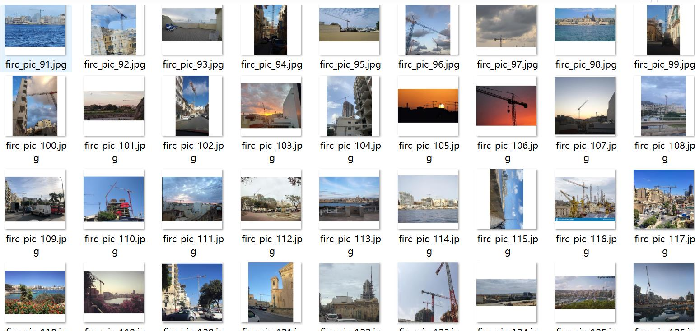
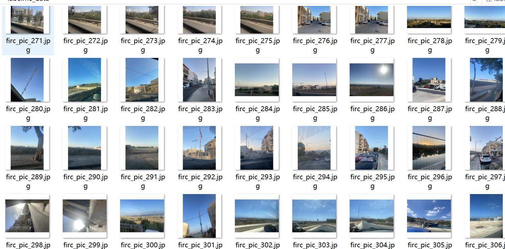
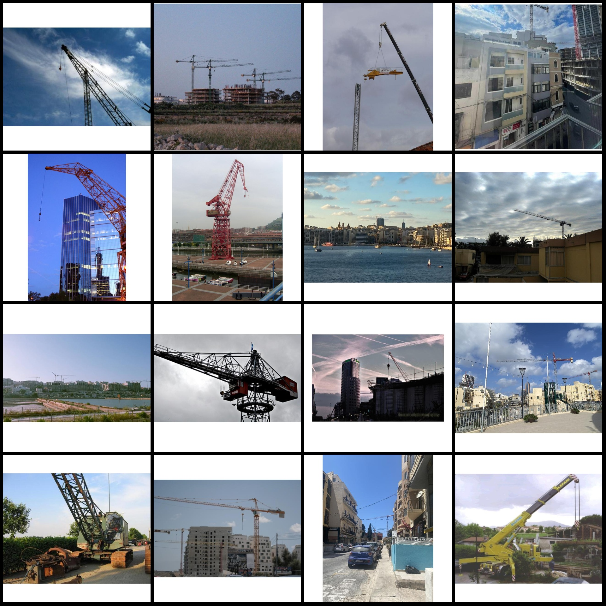
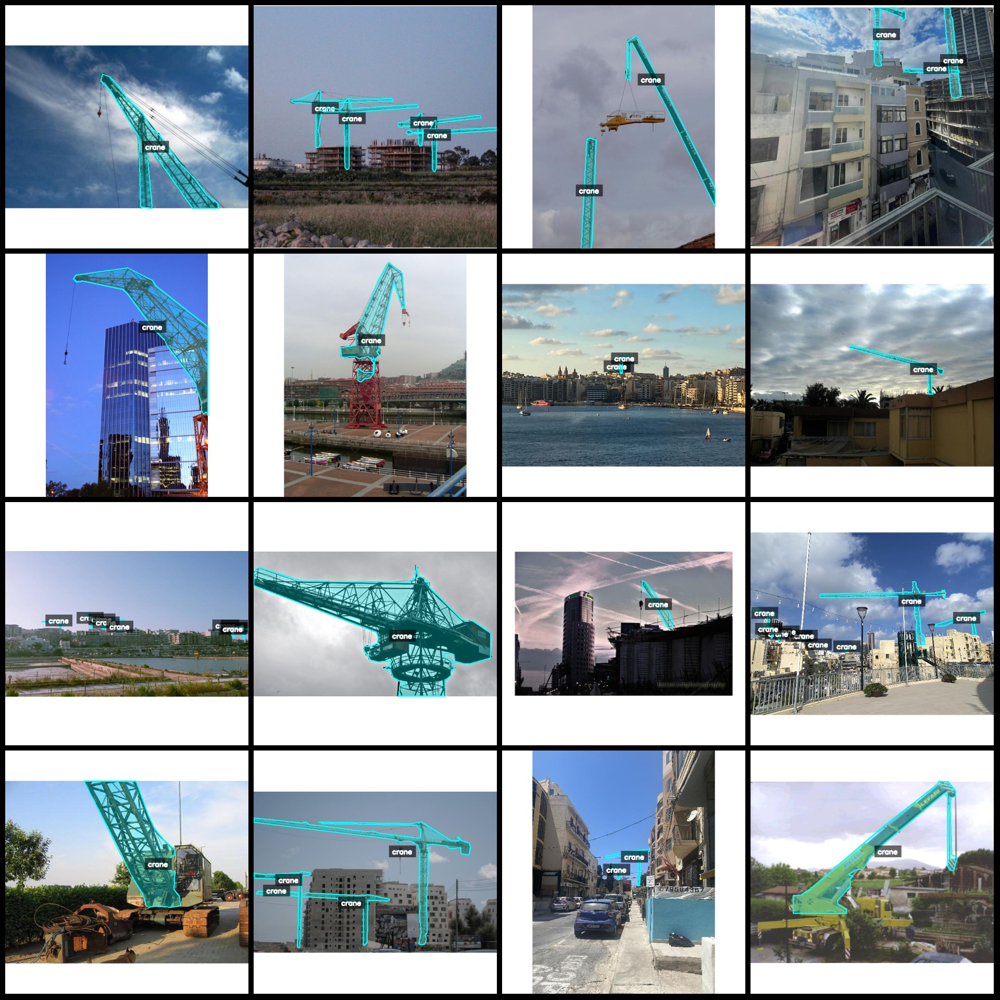
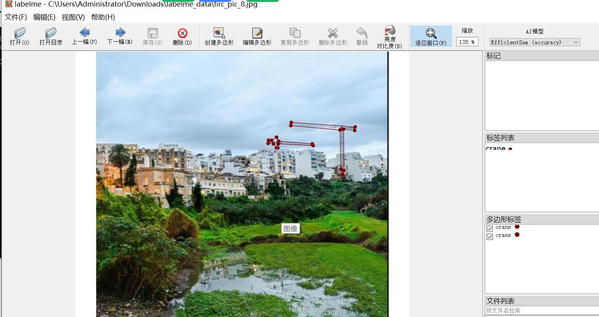

# Crane Identification and Segmentation Dataset

## Dataset Format: LabelMe Format (Without mask files, only containing JPG images and corresponding JSON files)

### Image Details:
- Number of JPG files: 795
- Number of JSON files: 795
- Number of categories: 1
- Category name: "crane"
- Box count for each category: 2108
- Total boxes: 2108

### Annotation Tool: LabelMe v5.5.0

### Image Resolution: 640x640

### Annotation Rules: Polygons are drawn around the categories.

### Special Notes: The dataset can be edited using LabelMe, but the JSON dataset needs to be converted into either a Mask or YOLOF format for semantic segmentation or instance segmentation.

### Remarks: This dataset does not guarantee the accuracy of the trained model or weight files.

### Preview of Images with Annotations:

#### Example of Annotations:

- **Randomly selected 16 images**
- **Annotation drawing results**
- **LabelMe editing example**

## Images

Here is a pay link on Stripe ( https://buy.stripe.com/3cs8yP7sY87d0vu9AB ). Please contact me lonlonago@foxmail.com after funding $89, and I will send you a complete data files , thank you!

